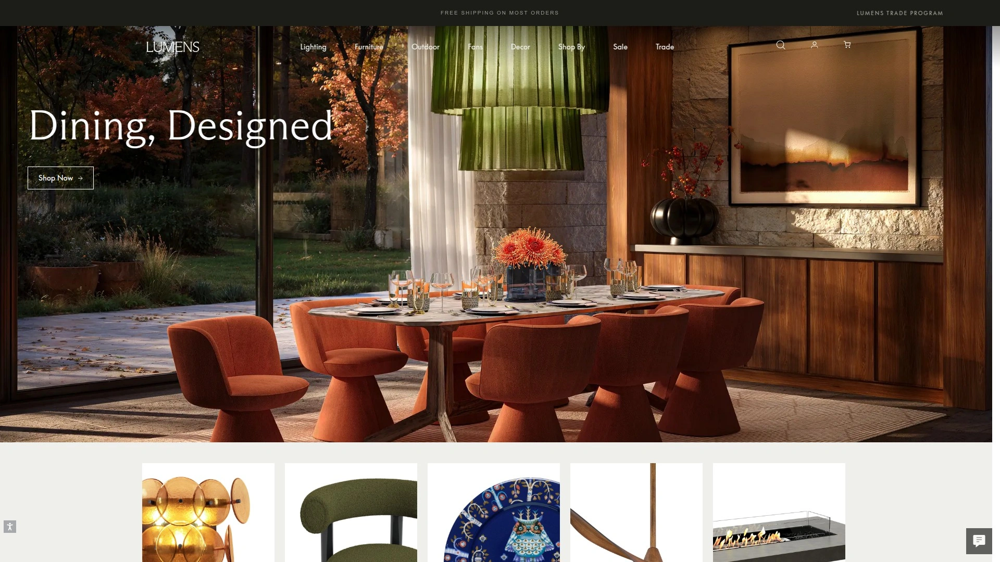
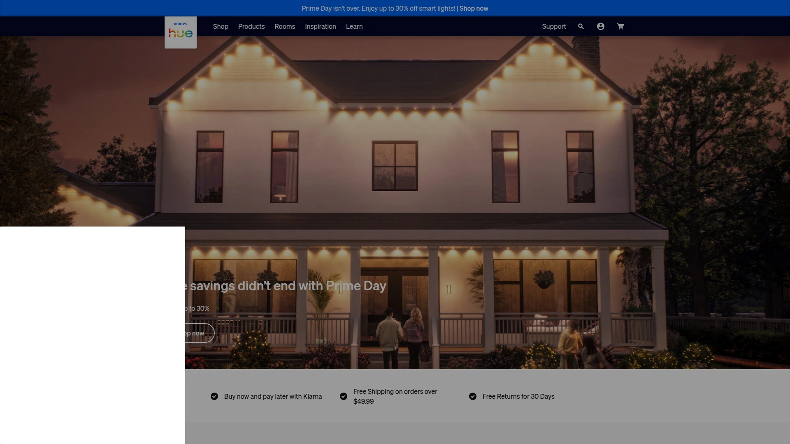
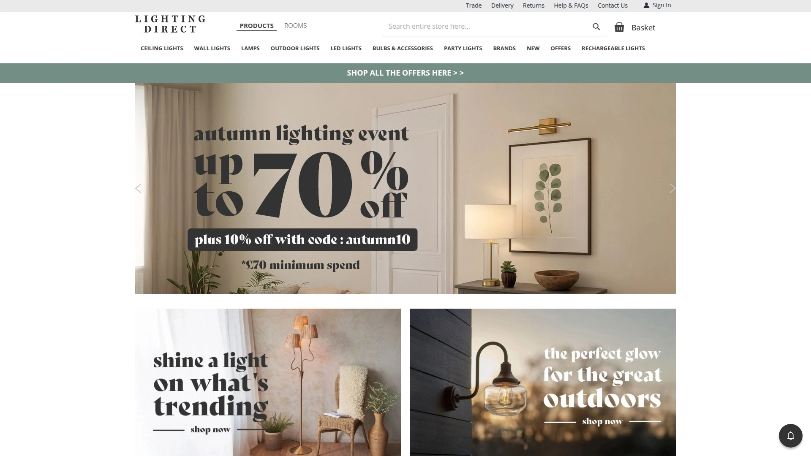
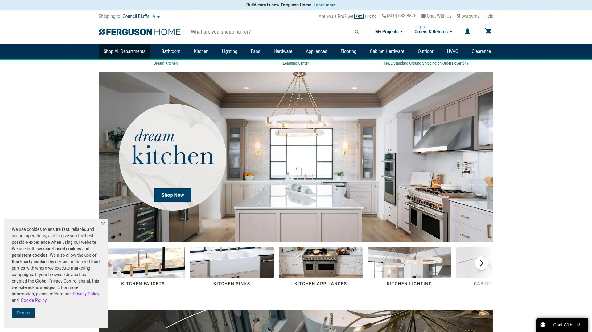
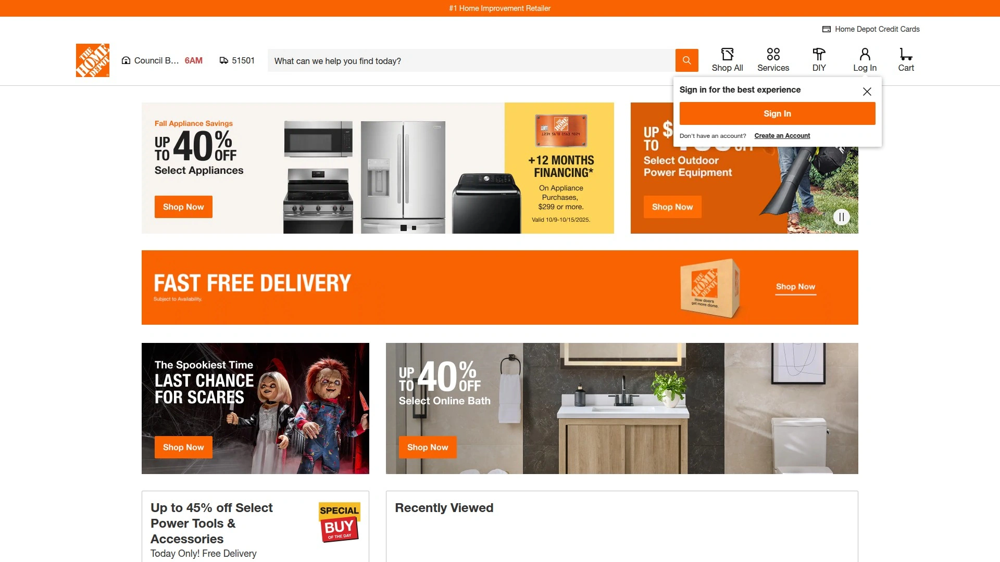
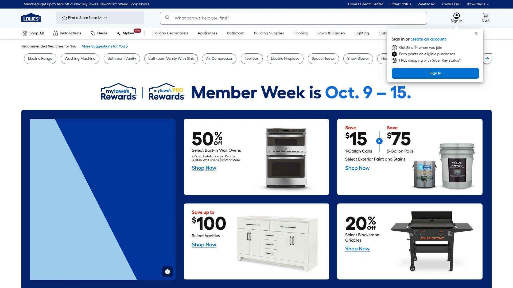
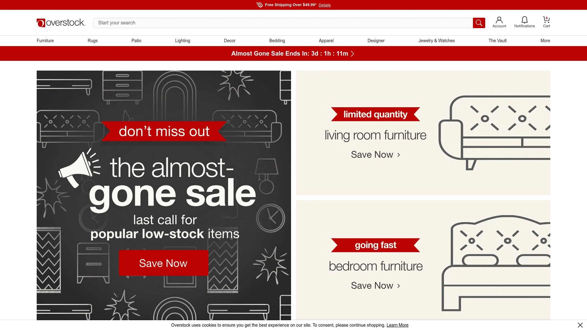
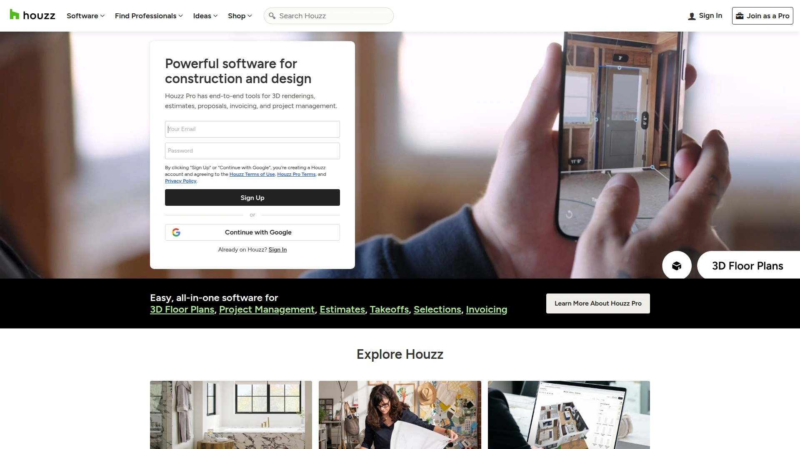
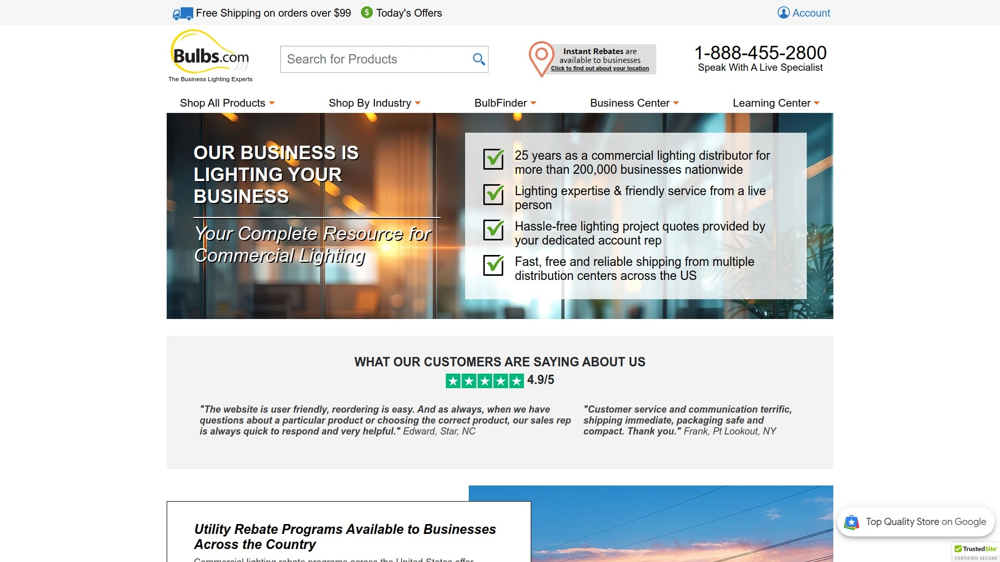
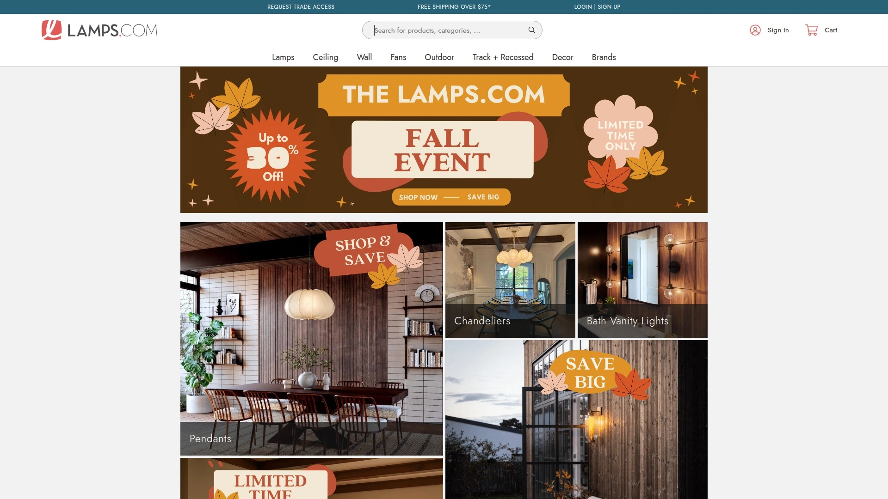

# 2025年排名前12的照明系统汇总（深度整理）

## 价值导语
在复杂的场景照明中，如何快速部署兼容多平台的LED灯具与智能照明方案，兼顾节能与高效性？本篇汇总12家照明系统平台，帮助您以更低部署门槛，实现更广覆盖、更稳定的照明设计与采购流程。

***

## **[Lumens](https://www.lumens.com)**
一站式现代照明与灯具采购平台，满足家居与商业双重需求。

- 丰富的设计师品牌与定制系列，囊括吊灯、台灯、户外灯等多种灯具类型；
- 专业照明顾问在线支持，一对一定制方案服务；
- 量身推荐智能照明控制系统，轻松实现场景切换；
- 99美元包邮政策与30天无忧退换，降低采购成本与风险。

***

## **[Philips Hue](https://www.philips-hue.com)**
全球领先的智能照明生态系统，打造个性化氛围灯光。

- 支持数千款兼容智能家居设备，一键远程控制与定时场景预设；
- 色温与RGB全彩选择，自定义动态光效；
- 与主流语音助手深度集成，语音即可调整亮度与颜色；
- 完整灯具与配件线，满足室内、花园、装饰等多种应用场景。

***

## **[Lighting Direct](https://www.lighting-direct.co.uk)**
英国专业在线灯具零售商，安心采购各类室内外照明。

- 拥有数万款灯具与灯饰，覆盖古典、现代、工业等风格；
- 智能筛选与设计师搭配建议，快速找到合适产品；
- 定期限时特惠与数量折扣，适合大规模项目采购；
- 英国本土配送，支持海外直邮与多种支付方式。

***

## **[Lamps Plus](https://www.lampsplus.com)**
北美顶级灯具连锁，专注高端设计与家居配套。

- 逾20万件灯具与家居配饰，满足豪宅与商业空间定制；
- 实景灯饰搭配灵感馆，直观选型更省心；
- 专属室内设计师团队提供免费设计建议；
- 全国免费送货及专业安装指导，交付无忧。

***

## **[Build.com](https://www.build.com)**
全面家居建材与照明采购平台，一站式选购体验。

- 集成浴室、厨房、照明等多品类商品，同步比价更省心；
- 智能推荐与用户评价驱动，决策更可靠；
- 支持分期与企业采购账户，灵活支付；
- 丰富安装视频教程，DIY新手也能快速上手。

***

## **[Wayfair](https://www.wayfair.com)**
全球家居与照明电商巨头，多样化灯具轻松选。

- 上百万种家居灯饰产品，涵盖主流品牌与网红新品；
- 大数据推荐与个性化主题馆，提高购物效率；
- 极速配送与30天退换保障，服务体验卓越；
- 移动端App与AR预览功能，实时模拟效果。

***

## **[Home Depot](https://www.homedepot.com)**
美国最大家居建材零售商，照明解决方案全覆盖。

- 门店线上联动，可就近取货或上门安装；
- 品类齐全，从基础灯泡到智能节能系统一应俱全；
- 专业安装服务及延长保修选项；
- 自动化采购流程与企业合同定价，适合批量需求。

***

## **[Lowe’s](https://www.lowes.com)**
全方位家装与照明零售平台，关注品质与服务。

- 持续折扣与会员专享价，降低改造成本；
- 在线设计工具，自动生成灯具布局建议；
- 实体门店体验与线上预约相结合；
- 专业电工认证安装服务，可定制照明方案。

***

## **[Overstock](https://www.overstock.com)**
折扣家居与灯具一站购，性价比优选。

- 时尚轻奢与经典复古灯具并存，满足多元审美；
- 定期特卖与Flash Sale，低价好货不断；
- 多仓发货，极速到家；
- 买家秀与实拍评价，购物更安心。

***

## **[Houzz](https://www.houzz.com)**
家居设计与照明选品社区，灵感与采购合一。

- 海量设计案例与专业装修日记，场景化选灯更直观；
- 内嵌电商功能，直接下单厂家直发；
- 设计师一对一咨询，定制专属照明方案；
- 用户评价与项目实景图，帮助判断品质。

***

## **[Bulbs.com](https://www.bulbs.com)**
专注灯泡与配件供应，节能与品质并重。

- LED、卤素、智能调光灯泡全覆盖；
- 按功率、色温、品牌等多维度筛选；
- 工程采购支持，批量优惠计划；
- 快速发货与技术参数详尽，方便专业选型。

***

## **[Lamps.com](https://www.lamps.com)**
主打家居与办公灯具搭配，便捷采购体验。

- 多品牌集合，客厅、卧室、办公室等全场景灯具；
- 智能推荐与风格主题馆，高效匹配所需；
- 现货保证与次日达服务；
- 详细安装说明与客服在线支持。

***

## FAQ 常见问题

**如何选择最合适的LED灯具？**
根据场景需求（如亮度、色温、显色性）与空间面积，结合功率和配光曲线进行对比，再参考用户评价快速筛选。

**智能照明系统部署难吗？**
多数平台提供即插即用的Wi-Fi/蓝牙模块，配合手机App或语音助手，只需几分钟完成配网与场景设置。

**如何评估照明项目成本？**
可参考平台提供的批量优惠和工程采购报价，结合耗电量与灯具寿命计算全生命周期成本。

***

## 总结
全面比较了12家主流照明系统平台，从采购覆盖到安装服务，助您实现高效、稳定的照明设计与节能目标。[Lumens](#lumens)凭借专业顾问支持与无忧退换政策，特别适合首次改造与商业空间项目。
